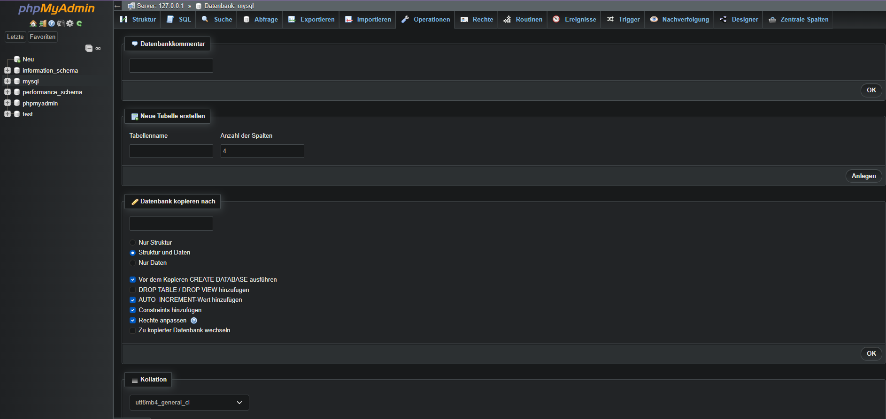

# 🗄️ Tag 1 – Installation

> 💬 **Claude Prompt für dieses File:**
> *„Analysiere das ganze Repo, aktualisiere jedes Diagramm oder Darstellung auf den neusten Stand und füge bei neuen Seiten hinzu."*

---

### 🔧 Durchgeführte Schritte

- [XAMPP](https://www.apachefriends.org) heruntergeladen und installiert
- **Apache** und **MySQL** im XAMPP Control Panel gestartet
- [phpMyAdmin](http://localhost/phpmyadmin) im Browser geöffnet und verifiziert

---

### 💡 Erkenntnisse

Die Installation verlief reibungslos. Da XAMPP Apache, MySQL und phpMyAdmin als Bundle mitbringt, ist keine separate Konfiguration nötig. Einzige Besonderheit: Installation nach `C:\xampp` statt `C:\Program Files`, um UAC-Berechtigungsprobleme zu vermeiden.

Da die Installationsschritte bereits bekannte Grundlagen waren und in ca. 10 Minuten abgeschlossen wurden, lag der Fokus dieses Tages auf dem **Aufbau eines strukturierten und ansprechend gestalteten GitHub-Repositories** für das Lernportfolio. Dazu gehörten die Ordnerstruktur, Navigation zwischen Seiten, Badges, einheitliches Design sowie die Einrichtung des [Filesystem MCP Servers](https://modelcontextprotocol.io) für die Zusammenarbeit mit Claude AI.

---

### 📸 Screenshots

---

### ✅ [Checkpoint](../Checkpoints/README.md)

| Ziel | Status |
|------|--------|
| XAMPP installiert | ✅ |
| Apache gestartet | ✅ |
| MySQL gestartet | ✅ |
| phpMyAdmin erreichbar | ✅ |
| GitHub Repository aufgesetzt | ✅ |
| Lernportfolio-Struktur erstellt | ✅ |
| Filesystem MCP Server konfiguriert | ✅ |

---

| [🏠 Übersicht](../README.md) | [➡️ Tag 2](../2.Tag/README.md) |
|---|---|

---

$\textcolor{#8b949e}{\text{Hinweis: Diagramme, Rechtschreibung und Repo-Struktur wurden mit }} \textcolor{#D4622A}{\text{Claude AI Pro}} \textcolor{#8b949e}{\text{ generiert.}}$

<a href="../Prompts.md" style="color:#D4622A;">Prompts</a>
