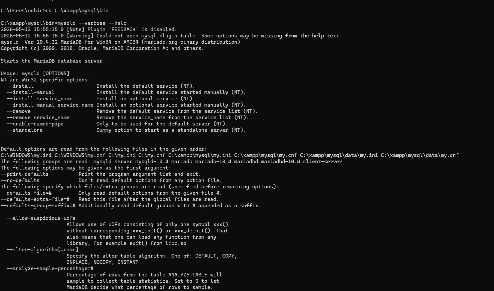
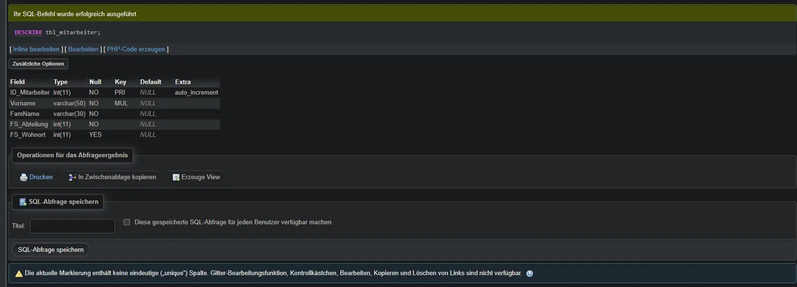
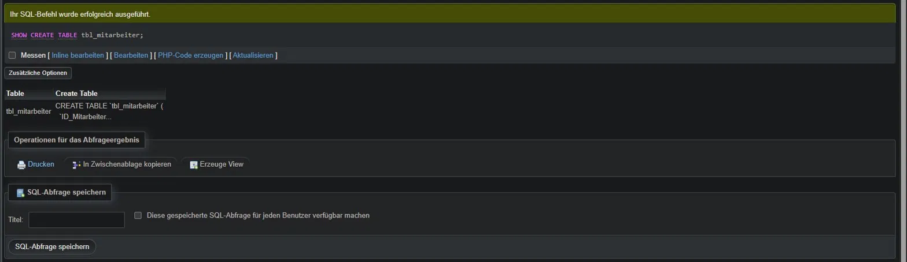
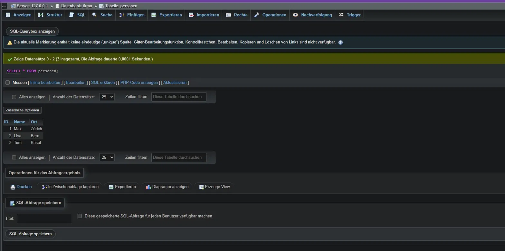
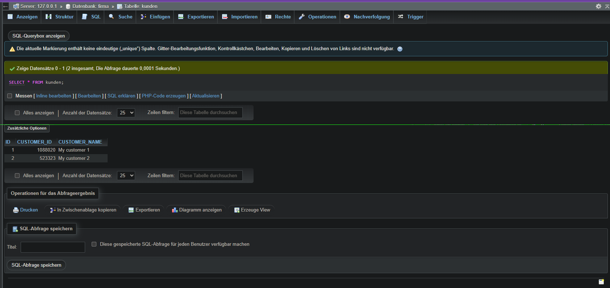

# 🗄️ Tag 2 – Konfiguration & Datenimport


> 💬 **Claude Prompt für dieses File:**
> *„Analysiere das ganze Repo, aktualisiere jedes Diagramm oder Darstellung auf den neusten Stand und füge bei neuen Seiten hinzu."*

---

### ⚙️ my.ini – Konfigurationsdatei

**Was ist die my.ini?**
Die `my.ini` (Windows) bzw. `my.cnf` (Linux) ist die zentrale Konfigurationsdatei von MariaDB/MySQL. Sie steuert das Verhalten des Servers und Clients – z.B. Port, Zeichensatz, Datenpfade und Speicher-Limits.

**Wo liegt sie?**
Bei XAMPP unter: `C:\xampp\mysql\bin\my.ini`

**Wichtige Abschnitte:**
| Abschnitt | Gilt für | Beispiel |
|-----------|----------|---------|
| `[mysqld]` | Server | Port, Zeichensatz, InnoDB-Einstellungen |
| `[client]` | Client | Standard-Zeichensatz |
| `[mysql]` | mysql-Monitor | Prompt-Einstellungen |

**Optionen anzeigen:**
```cmd
mysqld --verbose --help
mysql --verbose --help
```
→ Zeigt welche Konfigurationsdateien geladen werden und welche Einstellungen aktiv sind.



---

### 🗃️ Datenbank `firma` anlegen

Eine neue Datenbank wurde mit der Kollation `utf8mb4_unicode_ci` angelegt.

**Was ist Kollation?**
Kollation definiert, wie Zeichen **sortiert** und **verglichen** werden. `utf8mb4_unicode_ci` bedeutet:
- `utf8mb4` → unterstützt alle Unicode-Zeichen inkl. Emojis (4 Bytes)
- `unicode` → sortiert nach Unicode-Standard
- `ci` → Case Insensitive (Gross-/Kleinschreibung wird ignoriert)

**Warum nicht einfach `utf8`?**
`utf8` in MySQL/MariaDB unterstützt nur 3 Byte-WZeichen wie Emojis oder bestimmte asiatische Schriftzeichen werden abgeschnitten. `utf8mb4` ist der korrekte Standard seit MySQL 5.5.3.

---

### 📥 Daten importieren

#### SQL-Dump importieren
Ein SQL-Dump ist eine Textdatei mit SQL-Befehlen (`CREATE TABLE`, `INSERT INTO` usw.), die eine Datenbank vollständig wiederherstellen kann.

```sql
-- Via phpMyAdmin: Importieren → SQL
-- Via Konsole:
SOURCE C:/pfad/tbl_mitarbeiter.sql;
```

**Nach dem Import:**
- Überflüssigen Index `plz_ort_ID` gelöscht (doppelter Primary Key)
- Tabellentyp von **MyISAM → InnoDB** umgestellt für Transaktionsunterstützung

#### Tabellenstruktur untersuchen

```sql
DESCRIBE tbl_mitarbeiter;
SHOW CREATE TABLE tbl_mitarbeiter;
```

`DESCRIBE` zeigt Spalten, Datentypen und Constraints. `SHOW CREATE TABLE` zeigt das vollständige SQL-Statement, mit dem die Tabelle erstellt wurde – inkl. Engine, Kollation und Indexe.





---

### 📂 LOAD DATA INFILE

**Was macht LOAD DATA INFILE?**
Importiert Daten aus einer Textdatei direkt in eine Tabelle – deutlich schneller als einzelne `INSERT`-Befehle bei grossen Datenmengen.

```sql
CREATE TABLE personen (ID INT, Name VARCHAR(100), Ort VARCHAR(100));

LOAD DATA INFILE 'C:/xampp/mysql/data/personen.txt'
INTO TABLE personen
FIELDS TERMINATED BY ',';
```

**Vorteile gegenüber CSV-Import via phpMyAdmin:**
- Schneller bei grossen Dateien
- Mehr Kontrolle über Trennzeichen, Zeichensatz und Fehlerbehandlung
- Direkt via SQL steuerbar



---

### 🗂️ JSON Import

**Was ist JSON?**
JSON (JavaScript Object Notation) ist ein weit verbreitetes Dateiformat für strukturierte Daten. Viele APIs und moderne Applikationen liefern Daten im JSON-Format.

MariaDB ab Version 10.6 unterstützt `JSON_TABLE()` für direkten JSON-Import. Da die installierte Version **10.4.32** ist, wurde der Import alternativ via direktem `INSERT INTO VALUES` durchgeführt.

```sql
CREATE TABLE kunden (ID INT, CUSTOMER_ID INT, CUSTOMER_NAME VARCHAR(255));

INSERT INTO kunden VALUES
(1, 1088020, 'My customer 1'),
(2, 523323, 'My customer 2');
```



---

### 💾 Dump erstellen

Ein Dump ist ein komplettes Backup einer Datenbank als SQL-Datei. Mit `mysqldump` kann eine Datenbank exportiert und später wiederhergestellt werden.

```cmd
mysqldump.exe -u root -p --add-drop-table firma > C:\xampp\mysql\data\firma.sql
```

**`--add-drop-table`** → fügt vor jedem `CREATE TABLE` ein `DROP TABLE IF EXISTS` ein, damit beim Wiederherstellen keine Konflikte entstehen.

---

### 💡 Erkenntnisse

Da längere Zeit kein SQL mehr geschrieben wurde, mussten einzelne Befehle nachgeschlagen werden. Trotzdem verlief alles reibungslos.

**Probleme & Lösungen:**

| Problem | Ursache | Lösung |
|---------|---------|--------|
| `ALTER TABLE` für `FS_Wohnort` schlug fehl | Spalte war bereits im importierten SQL-Script enthalten | Schritt übersprungen |
| `JSON_TABLE` Syntax-Fehler | Funktion erst ab MariaDB 10.6 verfügbar, installiert ist 10.4.32 | Daten direkt via `INSERT INTO VALUES` eingefügt |

---

### 🔗 Weitere Seiten

- [✅ Checkpoint](./Checkpoint.md)
- [📋 Repetition SQL](./Repetition_SQL.md)
- [📋 Repetition Kap. 2 & 3](./Repetition_Kap2_3.md)

---

### ✅ [Checkpoint](./Checkpoint.md)

| Ziel | Status |
|------|--------|
| my.ini untersucht | ✅ |
| Datenbank `firma` angelegt | ✅ |
| SQL-Dump importiert | ✅ |
| Index gelöscht, InnoDB gesetzt | ✅ |
| Tabellenstruktur untersucht | ✅ |
| LOAD DATA INFILE ausgeführt | ✅ |
| JSON Import durchgeführt | ✅ |
| Dump erstellt | ✅ |

---

| [🏠 Übersicht](../README.md) | [⬅️ Tag 1](../1.Tag/README.md) | [✅ Checkpoints](../Checkpoints/README.md) | [➡️ Tag 3](../3.Tag/README.md) |
|---|---|---|---|

---

$\textcolor{#8b949e}{\text{Hinweis: Diagramme, Rechtschreibung und Repo-Struktur wurden mit }} \textcolor{#D4622A}{\text{Claude AI Pro}} \textcolor{#8b949e}{\text{ generiert und von mir überarbeitet.}}$

<a href="../Prompts.md" style="color:#D4622A;">Prompts</a>
