# 🗄️ Tag 3 – Transaktionen & Tabellentypen

> 💬 **Claude Prompt für dieses File:**
> *„Analysiere das ganze Repo, aktualisiere jedes Diagramm oder Darstellung auf den neusten Stand und füge bei neuen Seiten hinzu."*

---

### 🔧 Durchgeführte Schritte

- Tabellentypen InnoDB, MyISAM und Aria kennengelernt und verglichen
- Datenbank `transaktion2` erstellt, Tabelle mit InnoDB-Engine angelegt
- Engine-Wechsel MyISAM ↔ InnoDB mit `ALTER TABLE` durchgeführt
- Datenbank `hotel` importiert, Tabelle `benutzer` auf InnoDB umgestellt
- Dateistruktur im `data`-Verzeichnis analysiert (`.FRM`, `.MYD`, `.MYI`, `.ibd`)
- Tablespace mit `INNODB_SYS_TABLESPACES` abgefragt
- `my.ini` auf InnoDB-Einstellungen geprüft
- Konto-Transaktion mit `BEGIN`, `COMMIT` und `ROLLBACK` durchgeführt
- `AUTOCOMMIT=0` getestet
- Locking-Demos mit zwei CMD-Fenstern durchgeführt:
  - MyISAM Table-Lock
  - InnoDB `SELECT ... FOR UPDATE`
  - InnoDB `SELECT ... LOCK IN SHARE MODE` inkl. Deadlock
- Transaktions-Demo (Zeitpunkte 1–5) mit zwei Clients durchgespielt
- `SHOW ENGINE INNODB STATUS` und `LOCK TABLES` ausprobiert

---

### 💡 Erkenntnisse

Heute wurden neue SQL-Befehle kennengelernt, die bisher noch nicht verwendet wurden:

**`BEGIN`** – Startet eine Transaktion. Alle nachfolgenden SQL-Befehle werden erst mit `COMMIT` definitiv gespeichert oder mit `ROLLBACK` rückgängig gemacht. Ohne `BEGIN` wird jeder Befehl sofort ausgeführt (Autocommit).

**`UPDATE`** – Ändert bestehende Datensätze in einer Tabelle. Wichtig: Immer mit `WHERE` verwenden, sonst werden alle Zeilen geändert. Innerhalb einer Transaktion können `UPDATE`-Operationen durch Locks anderer Clients blockiert werden.

Besonders eindrücklich war der **Deadlock** bei `LOCK IN SHARE MODE` – MariaDB hat ihn automatisch erkannt und eine Transaktion abgebrochen. Ebenso interessant war die **Isolation**: Client B sah die Änderungen von Client A erst nach dem `COMMIT`.

---

### 📸 Screenshots

**Engine-Wechsel:**
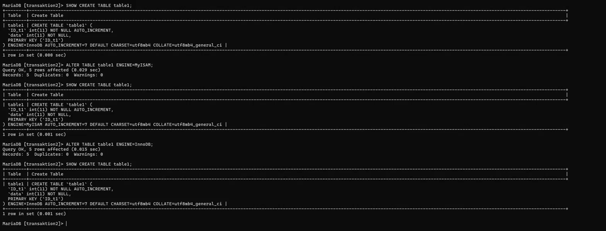

**Locking Demo:**
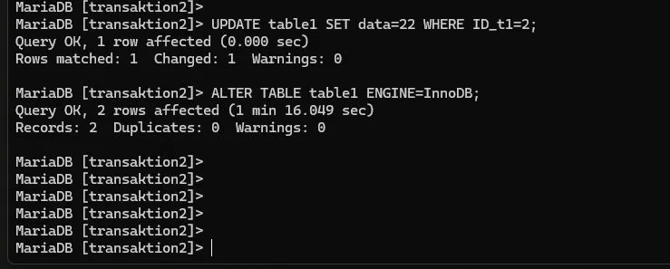

**SELECT FOR UPDATE:**
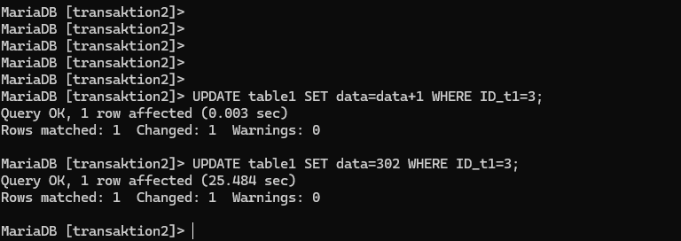

**LOCK IN SHARE MODE (inkl. Deadlock):**
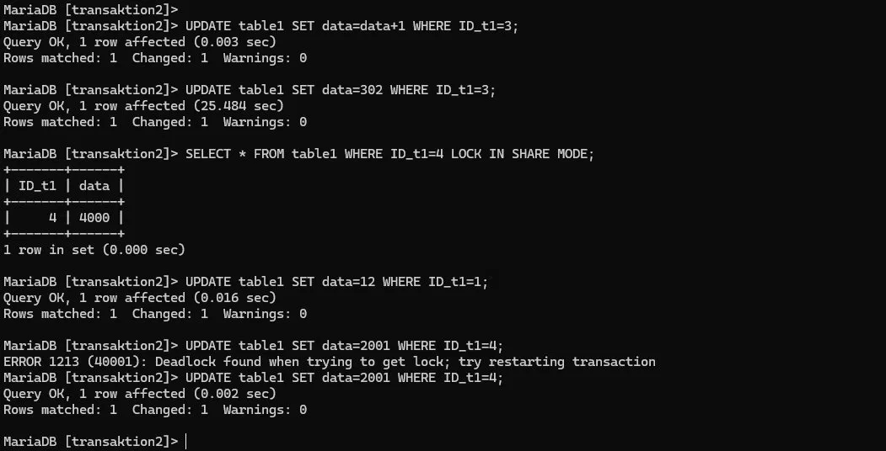

**Konto-Transaktion:**
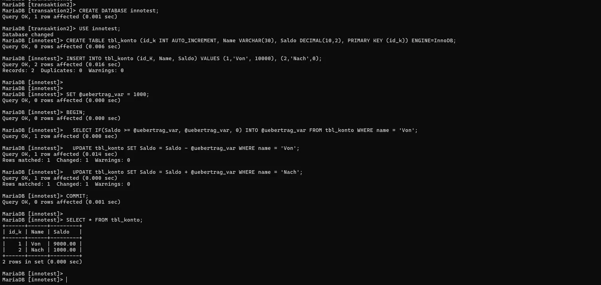

**ROLLBACK:**
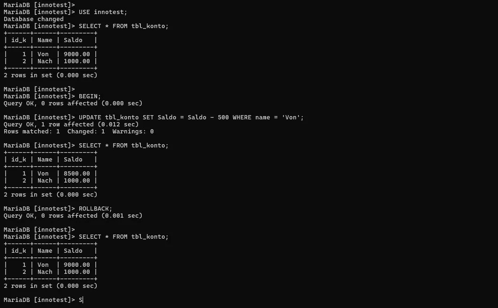

**Autocommit:**
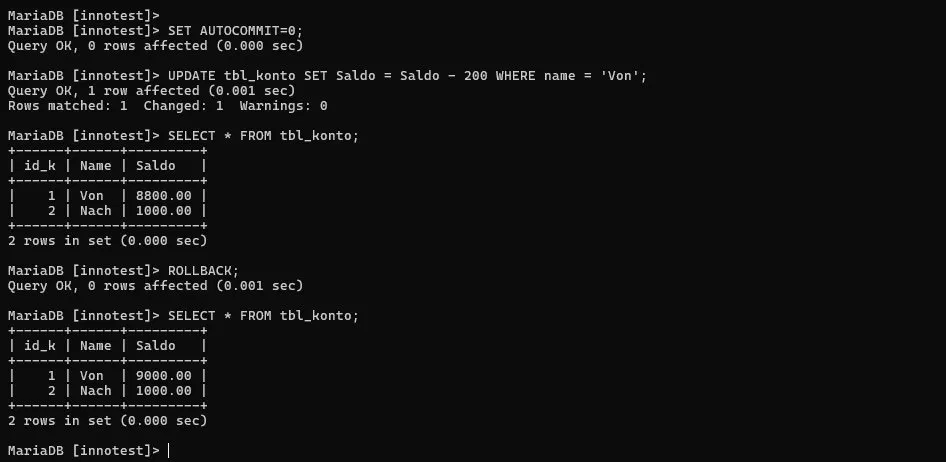

**Zeitpunkt 1 – Isolation:**
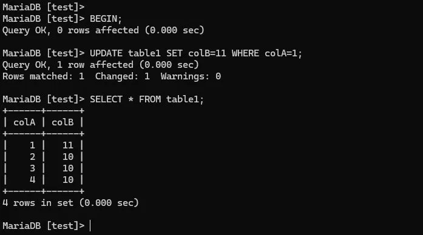
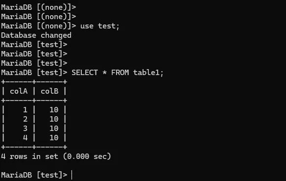

**Zeitpunkt 3 – COMMIT:**
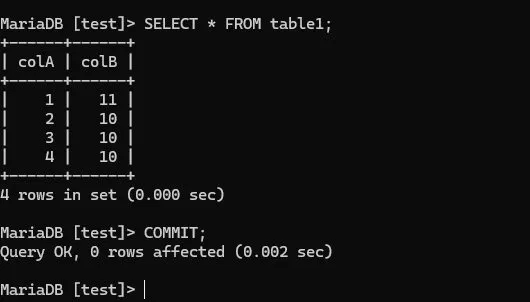

**Zeitpunkt 4 – ROLLBACK:**
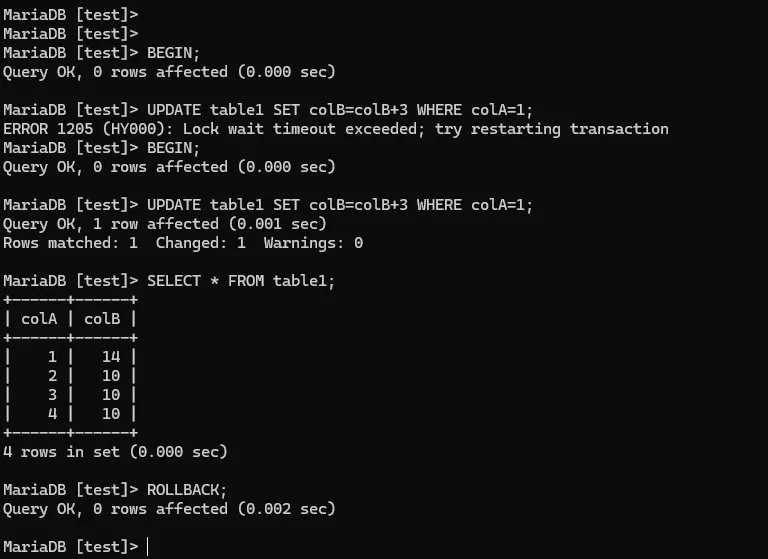

**InnoDB Status:**
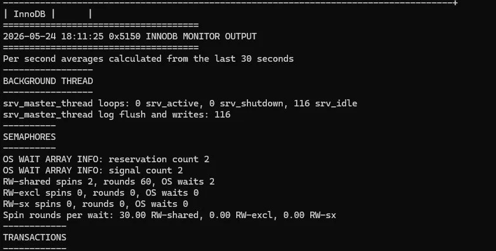

**my.ini InnoDB-Einstellungen:**
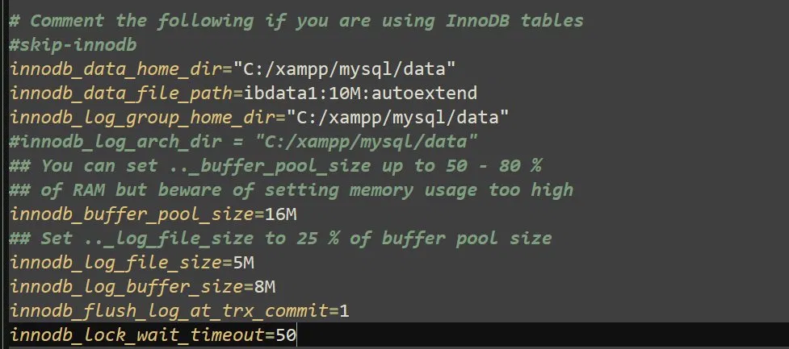

**Hotel Tabellen Engines:**
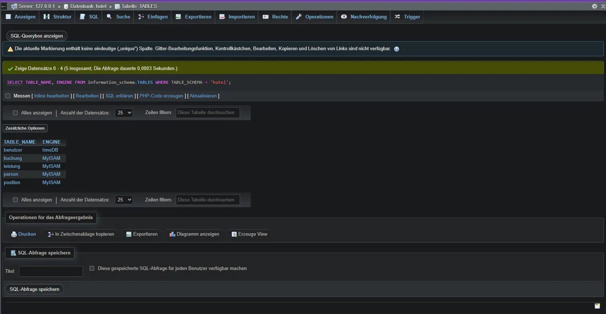

**Tablespace:**
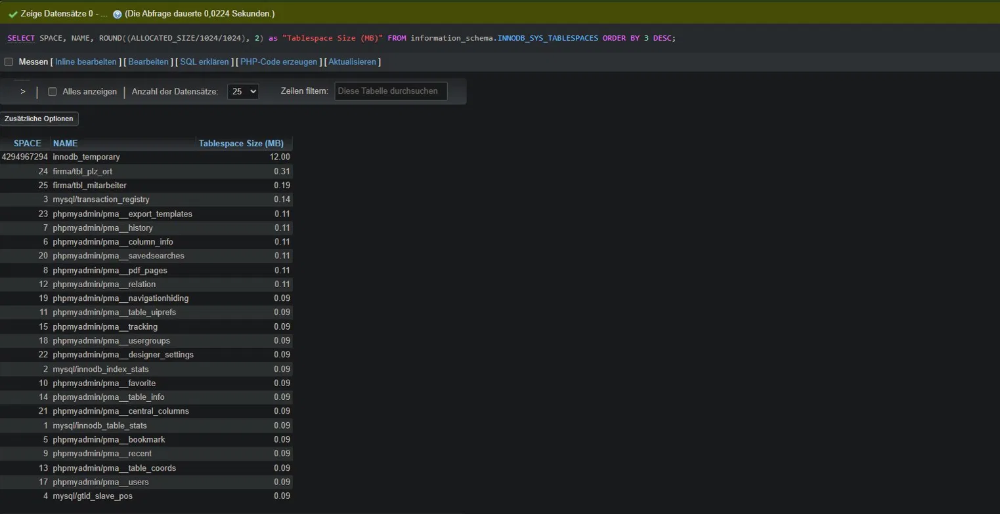

**data-Verzeichnis:**
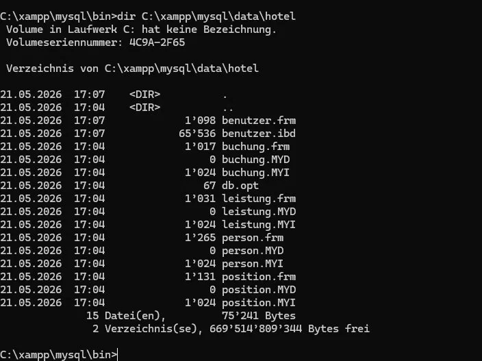

---

### 🔗 Weitere Seiten

- [✅ Checkpoint](./Checkpoint.md)

---

### ✅ [Checkpoint](./Checkpoint.md)

| Ziel | Status |
|------|--------|
| Tabellentypen verglichen | ✅ |
| Engine-Wechsel durchgeführt | ✅ |
| hotel DB importiert | ✅ |
| Tablespace abgefragt | ✅ |
| my.ini geprüft | ✅ |
| Transaktionen mit BEGIN/COMMIT/ROLLBACK | ✅ |
| AUTOCOMMIT getestet | ✅ |
| Locking-Demos (3 Arten) | ✅ |
| Transaktions-Demo Zeitpunkte 1–5 | ✅ |
| SHOW ENGINE INNODB STATUS | ✅ |
| LOCK TABLES | ✅ |

---

| [🏠 Übersicht](../README.md) | [⬅️ Tag 2](../2.Tag/README.md) | [✅ Checkpoints](../Checkpoints/README.md) | [➡️ Tag 4](../4.Tag/README.md) |
|---|---|---|---|

---

$\textcolor{#8b949e}{\text{Hinweis: Diagramme, Rechtschreibung und Repo-Struktur wurden mit }} \textcolor{#D4622A}{\text{Claude AI Pro}} \textcolor{#8b949e}{\text{ generiert.}}$

<a href="../Prompts.md" style="color:#D4622A;">Prompts</a>
