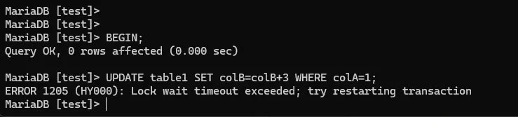
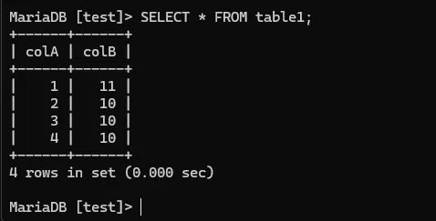

# 🗄️ Tag 3 – Transaktionen & Tabellentypen


> ⚠️ Dieser Tag wurde nicht am geplanten Datum (26.05.2026) durchgeführt, sondern aufgeteilt auf den **22. und 24. April 2026**.

> 💬 **Claude Prompt für dieses File:**
> *„Analysiere das ganze Repo, aktualisiere jedes Diagramm oder Darstellung auf den neusten Stand und füge bei neuen Seiten hinzu."*

---

### 🗄️ Tabellentypen – InnoDB, MyISAM & Aria

MariaDB unterstützt verschiedene Storage Engines. Die wichtigsten im Überblick:

| Engine | Locking | Transaktionen | Crash-Recovery | Einsatz |
|--------|---------|---------------|----------------|---------|
| **InnoDB** | Row-Level | ✅ Vollständig (ACID) | ✅ Automatisch | Produktive DBs, Standard |
| **MyISAM** | Table-Level | ❌ Keine | ❌ Keine | Einfache Lesezugriffe |
| **Aria** | Table-Level | ⚠️ Grundlegend | ⚠️ Teilweise | Weniger kritische Systeme |

**Warum InnoDB bevorzugen?**
InnoDB sperrt nur die betroffenen Datensätze (Row-Level-Locking), nicht die ganze Tabelle. Das bedeutet: Mehrere Benutzer können gleichzeitig auf verschiedene Zeilen zugreifen, ohne sich gegenseitig zu blockieren. Bei MyISAM muss immer die ganze Tabelle gewartet werden.

**Engine wechseln:**
```sql
ALTER TABLE tabellenname ENGINE=InnoDB;
```

**Verzeichnisstruktur nach Engine:**
- MyISAM erzeugt 3 Dateien: `.FRM` (Struktur), `.MYD` (Daten), `.MYI` (Index)
- InnoDB erzeugt 2 Dateien: `.FRM` (Struktur), `.ibd` (Daten + Index im Tablespace)

Der Unterschied ist im `data`-Verzeichnis klar sichtbar – `benutzer` (InnoDB) hat `.ibd`, alle anderen (MyISAM) haben `.MYD` + `.MYI`.


---

### 🏨 Hotel-Datenbank

Die `hotel`-Datenbank wurde importiert. Standardmässig waren alle Tabellen auf **MyISAM** – die Tabelle `benutzer` wurde manuell auf **InnoDB** umgestellt. Die Abfrage aller Tabellentypen zeigt den Unterschied deutlich.


---

### 💾 Tablespace & my.ini

**Was ist ein Tablespace?**
Der Tablespace ist eine virtuelle Speicherdatei (`ibdata1`), in der InnoDB alle Tabellendaten zentral ablegt. Er wächst automatisch (`autoextend`), wenn mehr Speicher benötigt wird.

```sql
SELECT SPACE, NAME, ROUND((ALLOCATED_SIZE/1024/1024), 2) as "Tablespace Size (MB)"
FROM information_schema.INNODB_SYS_TABLESPACES
ORDER BY 3 DESC;
```


**my.ini – InnoDB-Einstellungen:**
In der `my.ini` wurden folgende wichtige Einstellungen geprüft:
- `#skip-innodb` → auskommentiert, InnoDB ist aktiv
- `innodb_data_file_path=ibdata1:10M:autoextend` → Tablespace wächst automatisch
- `innodb_lock_wait_timeout=50` → Client wartet max. 50 Sekunden auf einen Lock


---

### 🔄 Transaktionen – ACID

**Was ist eine Transaktion?**
Eine Transaktion ist eine Gruppe von SQL-Befehlen, die entweder **komplett** ausgeführt oder **komplett rückgängig** gemacht werden. Das schützt die Datenkonsistenz.

**ACID-Prinzip:**
| Buchstabe | Bedeutung | Erklärung |
|-----------|-----------|-----------|
| **A** | Atomicity | Alles oder nichts |
| **C** | Consistency | DB bleibt immer konsistent |
| **I** | Isolation | Transaktionen beeinflussen sich nicht gegenseitig |
| **D** | Durability | Abgeschlossene Transaktionen sind dauerhaft |

**Steuerung:**
```sql
BEGIN;              -- Transaktion starten
UPDATE ...;         -- Operationen ausführen
COMMIT;             -- Dauerhaft speichern
-- oder
ROLLBACK;           -- Alles rückgängig machen
```

**Konto-Transaktion:**
Ein realistisches Beispiel: CHF 1000 von Konto "Von" auf "Nach" überweisen. Nur wenn beide `UPDATE`-Befehle erfolgreich sind, wird `COMMIT` ausgeführt – so kann nie Geld verschwinden.


**ROLLBACK-Demo:**
Nach einem `ROLLBACK` war der Saldo wieder auf dem ursprünglichen Stand – als wäre nichts passiert.


**AUTOCOMMIT=0:**
Mit `SET AUTOCOMMIT=0` wird jeder SQL-Befehl automatisch Teil einer Transaktion – auch ohne explizites `BEGIN`. Erst `COMMIT` macht die Änderung dauerhaft.


---

### 🔒 Locking – Wie sperrt InnoDB Datensätze?

**Warum Locking?**
Wenn mehrere Benutzer gleichzeitig dieselben Daten ändern wollen, kann es zu Inkonsistenzen kommen. Locking verhindert das – aber Locks sollten so schnell wie möglich freigegeben werden, damit andere Benutzer nicht blockiert werden.

**Demo 1 – MyISAM Table-Lock:**
Bei MyISAM wird die ganze Tabelle gesperrt. Client B musste warten, bis Client A die Tabelle freigab. Nach dem Wechsel auf InnoDB funktionierte das feinere Row-Locking korrekt.


**Demo 2 – SELECT FOR UPDATE:**
`SELECT ... FOR UPDATE` sperrt einen Datensatz bereits beim Lesen. Client B wartete **25 Sekunden** bis Client A committete – danach wurde automatisch weitergeführt.


**Demo 3 – LOCK IN SHARE MODE:**
`SELECT ... LOCK IN SHARE MODE` erlaubt anderen Clients, den Datensatz zu **lesen**, aber nicht zu **schreiben**. Interessant: Ein **Deadlock** trat auf – beide Clients warteten aufeinander. MariaDB erkannte ihn automatisch und brach eine Transaktion ab (ERROR 1213).


---

### 🧪 Transaktions-Demo (Zeitpunkte 1–5)

Mit zwei Clients wurde die **Isolation** von Transaktionen demonstriert – eine der wichtigsten ACID-Eigenschaften:

| Zeitpunkt | Client A | Client B | Erklärung |
|-----------|----------|----------|-----------|
| 1 | Sieht colB=**11** | Sieht colB=**10** | Isolation: B sieht uncommitted Änderungen von A nicht |
| 2 | Transaktion läuft | **Wartet** auf Lock | Row-Lock verhindert gleichzeitige Änderung |
| 3 | `COMMIT` | Läuft weiter | Nach COMMIT gibt A den Lock frei |
| 4 | Sieht colB=**11** | Sieht colB=**14**, `ROLLBACK` | B macht Änderung rückgängig |
| 5 | Sieht colB=**11** | Sieht colB=**11** | Beide sehen finalen Stand |

**Zeitpunkt 1 – Isolation sichtbar:** Client A sieht die eigene Änderung (colB=11), Client B sieht noch den alten Wert (colB=10).


**Zeitpunkt 3 – Lock wait timeout:** Client B wartete zu lange und erhielt einen Timeout-Fehler (ERROR 1205).



**Zeitpunkt 4 – ROLLBACK:** Client B sieht nach erfolgreichem Update colB=14, macht aber ROLLBACK – die Änderung wird verworfen.


**Zeitpunkt 5 – Finaler Stand:** Beide Clients sehen colB=11.



---

### 💡 Erkenntnisse

**`BEGIN`** – Startet eine Transaktion. Alle nachfolgenden Befehle werden erst mit `COMMIT` dauerhaft gespeichert oder mit `ROLLBACK` rückgängig gemacht. Ohne `BEGIN` wird jeder Befehl sofort ausgeführt (Autocommit).

**`UPDATE`** – Ändert bestehende Datensätze in einer Tabelle. Wichtig: Immer mit `WHERE` verwenden, sonst werden **alle** Zeilen geändert. Innerhalb einer Transaktion können `UPDATE`-Operationen durch Locks anderer Clients blockiert werden.

Besonders eindrücklich war der automatisch erkannte **Deadlock** und die **Isolation** – Client B sah die Änderungen von Client A erst nach dem `COMMIT`.

---

### 🔗 Weitere Seiten

- [✅ Checkpoint](./Checkpoint.md)

---

### ✅ [Checkpoint](./Checkpoint.md)

| Ziel | Status |
|------|--------|
| Tabellentypen verglichen | ✅ |
| Engine-Wechsel durchgeführt | ✅ |
| hotel DB importiert | ✅ |
| Tablespace abgefragt | ✅ |
| my.ini geprüft | ✅ |
| Transaktionen mit BEGIN/COMMIT/ROLLBACK | ✅ |
| AUTOCOMMIT getestet | ✅ |
| Locking-Demos (3 Arten) | ✅ |
| Transaktions-Demo Zeitpunkte 1–5 | ✅ |
| SHOW ENGINE INNODB STATUS | ✅ |
| LOCK TABLES | ✅ |

---

| [🏠 Übersicht](../README.md) | [⬅️ Tag 2](../2.Tag/README.md) | [✅ Checkpoints](../Checkpoints/README.md) | [➡️ Tag 4](../4.Tag/README.md) |
|---|---|---|---|

---

$\textcolor{#8b949e}{\text{Hinweis: Diagramme, Rechtschreibung und Repo-Struktur wurden mit }} \textcolor{#D4622A}{\text{Claude AI Pro}} \textcolor{#8b949e}{\text{ generiert.}}$

<a href="../Prompts.md" style="color:#D4622A;">Prompts</a>
